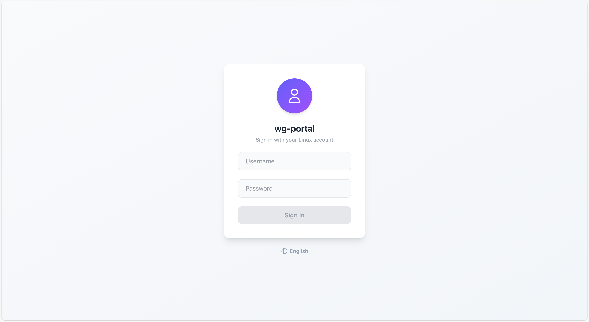
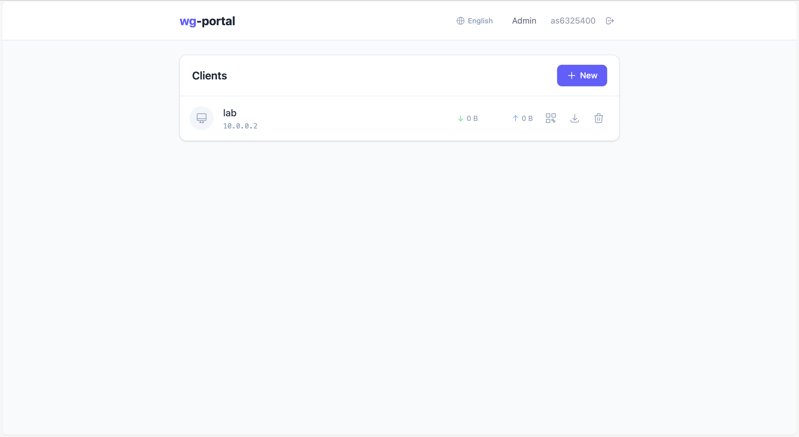
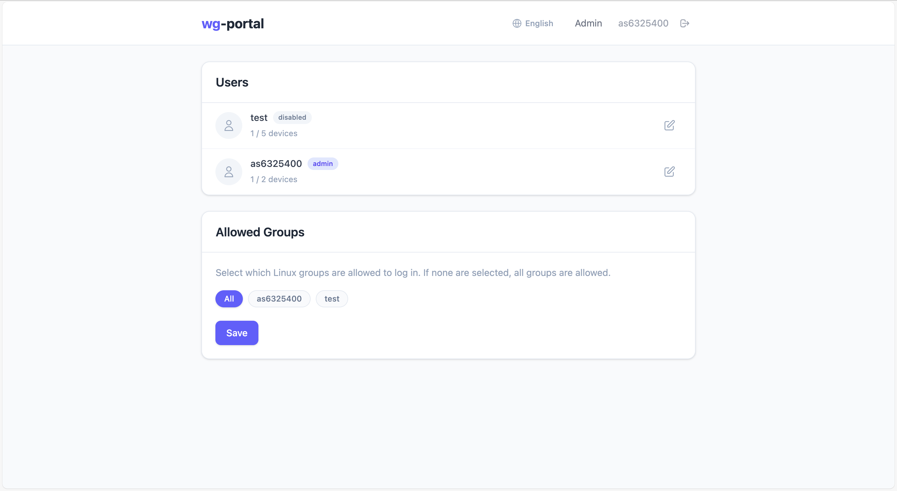

# wg-portal

[中文版 README](README_ZH.md)

A self-hosted WireGuard management web interface with Linux PAM authentication.


## Screenshots

### Login


### Dashboard


### Admin


## Features

- **Linux PAM Authentication** — Log in with existing Linux user accounts, no registration needed
- **Device Management** — Create, delete, and download WireGuard client configs
- **QR Code** — Scan config directly from the web UI with mobile WireGuard app
- **Traffic Stats** — Real-time bandwidth and last handshake monitoring
- **Admin Panel** — Manage users, device limits, and allowed Linux groups
- **Docker Ready** — Full Docker Compose setup with 3-container architecture

## Architecture

```
             :80          :51820/udp
              │                │
        ┌─────▼─────┐   ┌─────▼──────────────────────┐
        │  frontend  │   │  wireguard                 │
        │  (nginx)   │   │  (wg0 interface)           │
        │  dist/     │   │                            │
        └─────┬──────┘   │  ┌───────────────────────┐ │
              │          │  │ backend               │ │
     /api ────┼──────────┼─►│ Express :3000         │ │
              │          │  │ PAM + wg CLI          │ │
              │          │  └───────────────────────┘ │
              └──────────┴────────────────────────────┘
```

| Container | Role | Base Image |
|-----------|------|------------|
| **frontend** | Nginx serving built Vue SPA, proxies `/api` to backend | `nginx:alpine` |
| **backend** | Express API, PAM auth, WireGuard peer management | `node:22-bookworm-slim` |
| **wireguard** | WireGuard interface, auto-generates server config on first run | `alpine:3.19` |

Backend shares WireGuard's network namespace (`network_mode: service:wireguard`) for direct `wg` CLI access.

## Quick Start

### Prerequisites

- Docker + Docker Compose
- Linux kernel 5.6+ (built-in WireGuard support)

### 1. Download

```bash
git clone https://github.com/as6325400/wg-portal.git
cd wg-portal
```

### 2. Configure

```bash
cp .env.example .env
```

Edit `.env`:

```env
# Required
SESSION_SECRET=<random-64-char-string>
ENCRYPTION_KEY=<random-64-hex-char-string>
WG_ENDPOINT=your.server.public.ip:51820

# Optional
WG_SUBNET=10.0.0.0/24
WG_DNS=1.1.1.1
HTTP_PORT=80
TAG=latest                 # Docker image version (e.g. 1.0.0, 1.0.0-beta.1)
```

Generate secrets:

```bash
openssl rand -hex 32   # Use for both SESSION_SECRET and ENCRYPTION_KEY
```

### 3. Run

```bash
docker compose up -d
```

Images are automatically pulled from Docker Hub. To use a specific version:

```bash
TAG=1.0.0 docker compose up -d
```

Open `http://your-server` and log in with any Linux user account on the host.

> **Note:** Users in the `sudo` or `wheel` group (or `root`) are automatically granted admin access.

### Docker Images

| Image | Description |
|-------|-------------|
| [`as6325400/wg-portal-wireguard`](https://hub.docker.com/r/as6325400/wg-portal-wireguard) | WireGuard interface container |
| [`as6325400/wg-portal-backend`](https://hub.docker.com/r/as6325400/wg-portal-backend) | Express API + PAM auth |
| [`as6325400/wg-portal-frontend`](https://hub.docker.com/r/as6325400/wg-portal-frontend) | Nginx serving Vue SPA |

## Development

### Local Build

To build images locally instead of pulling from Docker Hub:

```bash
docker compose -f docker-compose.yml -f docker-compose.build.yml up --build
```

### Docker Dev Mode

Source code is mounted via volumes — changes take effect immediately without rebuilding images.

```bash
docker compose -f docker-compose.dev.yml up --build   # First time
docker compose -f docker-compose.dev.yml up            # After that
```

- Frontend: `http://localhost:5173` (Vite HMR)
- Backend: `node --watch` auto-restart

### Without Docker

Requires `wireguard-tools`, `build-essential`, `libpam0g-dev` on the host.

```bash
npm install

# Terminal 1 - Backend (needs sudo for wg commands)
sudo env PATH="$PATH" npx nodemon --watch server server/index.js

# Terminal 2 - Frontend
npm run dev:client
```

## Tech Stack

| Layer | Technology |
|-------|-----------|
| Frontend | Vue 3, Vite, Tailwind CSS v4, Pinia, Axios |
| Backend | Node.js 22, Express 5, better-sqlite3, express-session |
| Auth | Linux PAM (`authenticate-pam`), session-based |
| Database | SQLite (WAL mode) |
| VPN | WireGuard CLI (`wg genkey/pubkey/set/show`) |
| Encryption | AES-256-GCM for stored private keys |
| Container | Docker Compose, 3-service architecture |

## Configuration

| Variable | Default | Description |
|----------|---------|-------------|
| `SESSION_SECRET` | — | **Required.** Session encryption key |
| `ENCRYPTION_KEY` | — | **Required.** Private key encryption (64 hex chars) |
| `WG_ENDPOINT` | — | **Required.** Public endpoint for clients |
| `WG_INTERFACE` | `wg0` | WireGuard interface name |
| `WG_SUBNET` | `10.0.0.0/24` | VPN subnet |
| `WG_SERVER_IP` | `10.0.0.1` | Server IP in VPN subnet |
| `WG_DNS` | `1.1.1.1` | DNS for VPN clients |
| `WG_ALLOWED_IPS` | `0.0.0.0/0` | Allowed IPs for clients |
| `WG_PORT` | `51820` | WireGuard listen port |
| `HTTP_PORT` | `80` | Frontend HTTP port |
| `PORT` | `3000` | Backend server port |
| `TAG` | `latest` | Docker image version tag |

## Project Structure

```
wg-portal/
├── docker-compose.yml          # Production deployment (pulls from Docker Hub)
├── docker-compose.build.yml    # Override to build images locally
├── docker-compose.dev.yml      # Development with hot reload
├── docker/
│   ├── Dockerfile.frontend     # Multi-stage: Node build → Nginx
│   ├── Dockerfile.backend      # Node 22 + PAM + wg-tools
│   ├── Dockerfile.wireguard    # Alpine + wireguard-tools
│   ├── nginx.conf              # Static files + API proxy
│   └── wg-entrypoint.sh        # Auto-generate WG server config
├── server/
│   ├── index.js                # Express entry point
│   ├── config.js               # Environment config
│   ├── db.js                   # SQLite schema & init
│   ├── crypto.js               # AES-256-GCM encryption
│   ├── middleware/              # Auth, session, rate limiting
│   ├── routes/                 # Auth, devices, admin APIs
│   └── services/               # PAM, WireGuard, IP allocator
├── src/
│   ├── views/                  # Login, Dashboard, Admin
│   ├── components/             # UI components
│   ├── stores/                 # Pinia auth store
│   ├── api/                    # Axios API wrappers
│   └── router/                 # Vue Router + guards
├── .env.example
└── package.json
```

## Security

- Private keys encrypted at rest (AES-256-GCM)
- Session cookies: `HttpOnly`, `SameSite=Strict`
- Login rate limiting (10 attempts / 15 min)
- PAM authentication against system accounts
- Admin access restricted to sudo/wheel/root users
- Input validation on all endpoints

## License

MIT
