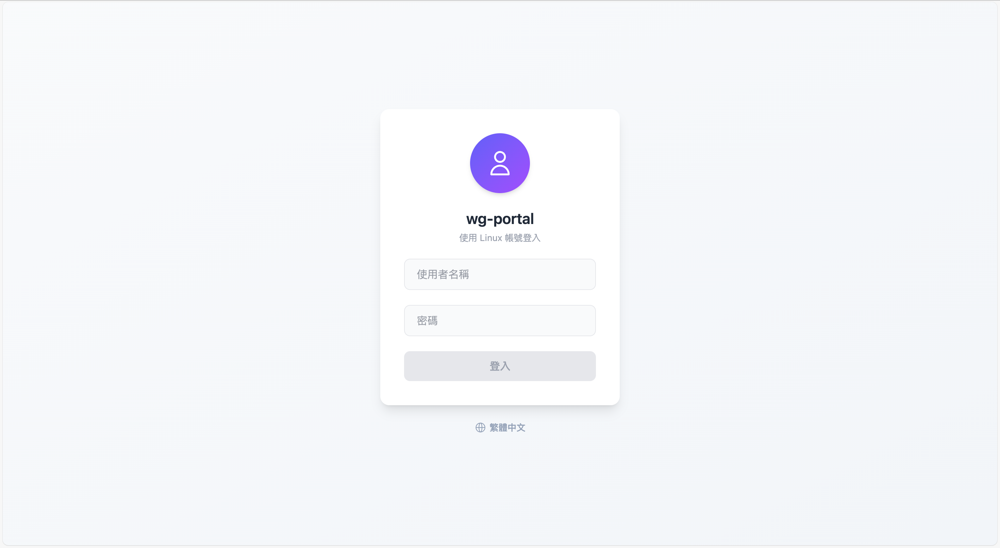
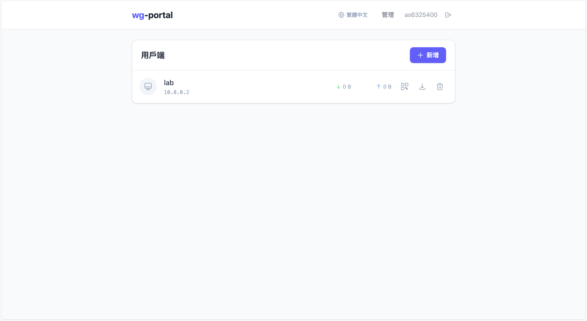
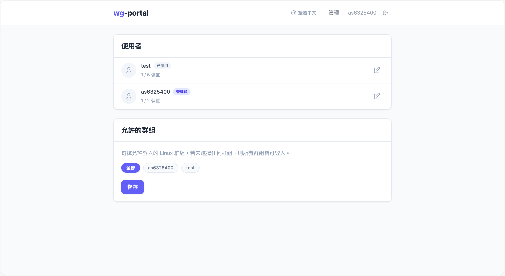

# wg-portal

[](README.md)


自架 WireGuard 管理網頁介面，支援 Linux PAM 認證。

## 截圖

### 登入


### 儀表板


### 管理


## 功能

- **Linux PAM 認證** — 使用現有 Linux 帳號登入，無需另外註冊
- **裝置管理** — 建立、刪除、下載 WireGuard 客戶端設定檔
- **QR Code** — 直接從網頁掃描，搭配手機 WireGuard App 使用
- **流量統計** — 即時頻寬與最後交握時間監控
- **管理面板** — 管理使用者、裝置上限、允許登入的 Linux 群組
- **Docker 部署** — 完整 Docker Compose 設定，三容器架構

## 架構

```
             :80          :51820/udp
              │                │
        ┌─────▼─────┐   ┌─────▼──────────────────────┐
        │  frontend  │   │  wireguard                 │
        │  (nginx)   │   │  (wg0 interface)           │
        │  dist/     │   │                            │
        └─────┬──────┘   │  ┌───────────────────────┐ │
              │          │  │ backend               │ │
     /api ────┼──────────┼─►│ Express :3000         │ │
              │          │  │ PAM + wg CLI          │ │
              │          │  └───────────────────────┘ │
              └──────────┴────────────────────────────┘
```

| 容器 | 角色 | 基底映像 |
|------|------|----------|
| **frontend** | Nginx 提供打包好的 Vue SPA，代理 `/api` 至後端 | `nginx:alpine` |
| **backend** | Express API、PAM 認證、WireGuard peer 管理 | `node:22-bookworm-slim` |
| **wireguard** | WireGuard 介面，首次啟動自動產生伺服器設定 | `alpine:3.19` |

後端透過 `network_mode: service:wireguard` 共享 WireGuard 的 network namespace，可直接使用 `wg` CLI。

## 快速開始

### 前置需求

- Docker + Docker Compose
- Linux 核心 5.6+（內建 WireGuard 支援）

### 1. 下載

```bash
git clone https://github.com/as6325400/wg-portal.git
cd wg-portal
```

### 2. 設定

```bash
cp .env.example .env
```

編輯 `.env`：

```env
# 必填
SESSION_SECRET=<隨機64字元字串>
ENCRYPTION_KEY=<隨機64位hex字串>
WG_ENDPOINT=你的伺服器公網IP:51820

# 選填
WG_SUBNET=10.0.0.0/24
WG_DNS=1.1.1.1
HTTP_PORT=80
```

產生密鑰：

```bash
openssl rand -hex 32   # SESSION_SECRET 和 ENCRYPTION_KEY 都可使用
```

### 3. 啟動

```bash
docker compose up -d
```

開啟 `http://你的伺服器` 並使用主機上的 Linux 帳號登入。

> **備註：** 屬於 `sudo` 或 `wheel` 群組的使用者（或 `root`）會自動獲得管理員權限。

## 開發

### Docker 開發模式

原始碼透過 volume 掛載——修改後即時生效，無需重新建置映像。

```bash
docker compose -f docker-compose.dev.yml up --build   # 第一次
docker compose -f docker-compose.dev.yml up            # 之後
```

- 前端：`http://localhost:5173`（Vite HMR 熱更新）
- 後端：`node --watch` 自動重啟

### 不使用 Docker

主機需安裝 `wireguard-tools`、`build-essential`、`libpam0g-dev`。

```bash
npm install

# 終端 1 - 後端（需要 sudo 執行 wg 指令）
sudo env PATH="$PATH" npx nodemon --watch server server/index.js

# 終端 2 - 前端
npm run dev:client
```

## 技術棧

| 層級 | 技術 |
|------|------|
| 前端 | Vue 3、Vite、Tailwind CSS v4、Pinia、Axios |
| 後端 | Node.js 22、Express 5、better-sqlite3、express-session |
| 認證 | Linux PAM（`authenticate-pam`）、session-based |
| 資料庫 | SQLite（WAL 模式） |
| VPN | WireGuard CLI（`wg genkey/pubkey/set/show`） |
| 加密 | AES-256-GCM 加密儲存私鑰 |
| 容器 | Docker Compose、三服務架構 |

## 設定參數

| 變數 | 預設值 | 說明 |
|------|--------|------|
| `SESSION_SECRET` | — | **必填。** Session 加密金鑰 |
| `ENCRYPTION_KEY` | — | **必填。** 私鑰加密金鑰（64 位 hex） |
| `WG_ENDPOINT` | — | **必填。** 客戶端連線的公網端點 |
| `WG_INTERFACE` | `wg0` | WireGuard 介面名稱 |
| `WG_SUBNET` | `10.0.0.0/24` | VPN 子網路 |
| `WG_SERVER_IP` | `10.0.0.1` | 伺服器在 VPN 子網路中的 IP |
| `WG_DNS` | `1.1.1.1` | VPN 客戶端使用的 DNS |
| `WG_ALLOWED_IPS` | `0.0.0.0/0` | 客戶端的 Allowed IPs |
| `WG_PORT` | `51820` | WireGuard 監聽埠 |
| `HTTP_PORT` | `80` | 前端 HTTP 埠 |
| `PORT` | `3000` | 後端伺服器埠 |

## 專案結構

```
wg-portal/
├── docker-compose.yml          # 正式部署
├── docker-compose.dev.yml      # 開發模式（熱更新）
├── docker/
│   ├── Dockerfile.frontend     # 多階段建置：Node build → Nginx
│   ├── Dockerfile.backend      # Node 22 + PAM + wg-tools
│   ├── Dockerfile.wireguard    # Alpine + wireguard-tools
│   ├── nginx.conf              # 靜態檔 + API 反向代理
│   └── wg-entrypoint.sh        # 自動產生 WG 伺服器設定
├── server/
│   ├── index.js                # Express 進入點
│   ├── config.js               # 環境變數設定
│   ├── db.js                   # SQLite schema 與初始化
│   ├── crypto.js               # AES-256-GCM 加密
│   ├── middleware/              # 認證、session、速率限制
│   ├── routes/                 # Auth、Devices、Admin API
│   └── services/               # PAM、WireGuard、IP 分配
├── src/
│   ├── views/                  # Login、Dashboard、Admin
│   ├── components/             # UI 元件
│   ├── stores/                 # Pinia auth store
│   ├── api/                    # Axios API 封裝
│   └── router/                 # Vue Router + 路由守衛
├── .env.example
└── package.json
```

## 安全性

- 私鑰以 AES-256-GCM 加密儲存
- Session Cookie：`HttpOnly`、`SameSite=Strict`
- 登入速率限制（15 分鐘內最多 10 次嘗試）
- PAM 認證對接系統帳號
- 管理員權限僅限 sudo/wheel/root 使用者
- 所有端點皆有輸入驗證

## 授權

MIT
